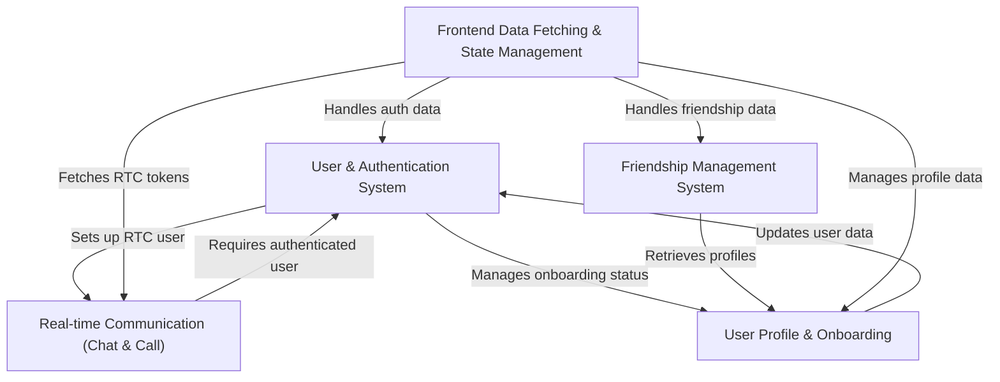

# Tutorial: Google_Meet_Clone

The **Google Meet Clone** is a social communication app that allows users to **create accounts**, *connect with friends*, and engage in *real-time chat and video calls*. It features a robust **authentication system**, a *friendship management system* for social interactions, and modules for **user profile setup and onboarding**, all powered by efficient *frontend data handling*.

## Visual Overview

## Chapters

1. [User & Authentication System
](01_user___authentication_system_.md)
2. [User Profile & Onboarding
](02_user_profile___onboarding_.md)
3. [Friendship Management System
](03_friendship_management_system_.md)
4. [Real-time Communication (Chat & Call)
](04_real_time_communication__chat___call__.md)
5. [Frontend Data Fetching & State Management
](05_frontend_data_fetching___state_management_.md)

---

Generated by [AI Codebase Knowledge Builder](https://github.com/The-Pocket/Tutorial-Codebase-Knowledge).